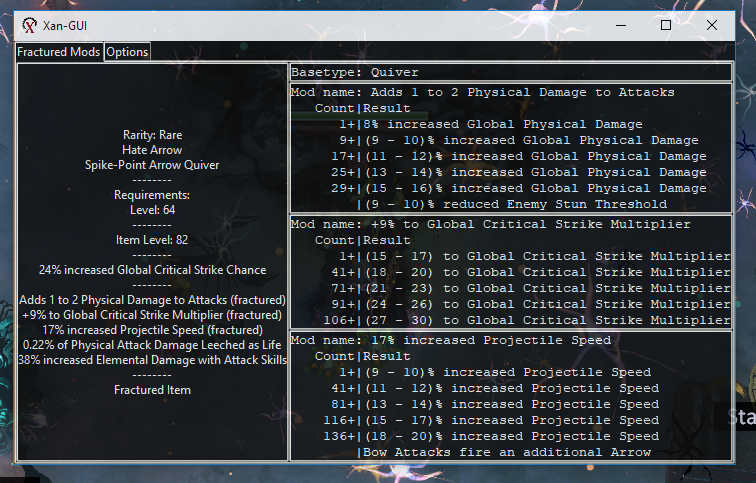

Tool to quickly check the potential results of a fractured mod on an item.

fractured_watcher.pyw is the main file.  Once the tkinter window is running it will poll your clipboard every second and then display information about any item on the clipboard.

This project is still in the development phase and does not have proper error handling yet.

